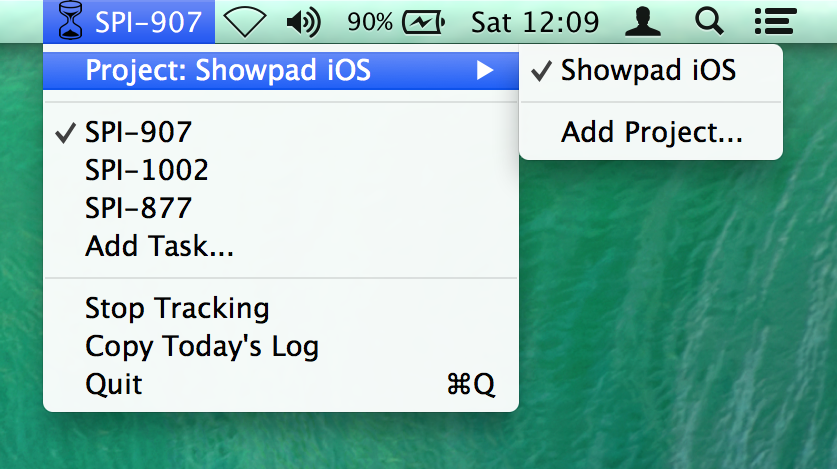

# Time Tracker
Simple time tracker written for the first Showpad hackathon.

## About

Time Tracker is a simple status bar application for Mac OS X that helps you keep track of how you spent your day. The goal is to keep things as simple and generic as possible.

Time can be tracked for projects and tasks.
Using __projects__, you can get a global overview of your day. Using __tasks__, you can get a more detailed view of how your time on each project was spent.

The most recent used projects and tasks are shown on top. If your list of tasks or projects becomes longer than 5 items, older items are displayed in a submenu.

## Usage

First you need to add one or more projects and tasks. Selecting a project and/or task will start tracking. You can use _Stop Tracking_ to take a break.

Time is tracked for projects and tasks separately, but selecting a different project will stop tracking for the current task in the previous project.

Using _Copy Today's Log_, you can copy a textual overview to the clipboard of how long you've worked on each project and its subtasks. Example output looks like this:

	14/03/15

	Showpad iOS:  12:00-12:15: 15m
	- SPI-907:  12:00-12:10: 10m
	- SPI-877:  12:10-12:15: 5m

## Planned Improvements

### Manually enter start time

When you forgot to turn on tracking or switch to a new task, you should be able to do it later on. Holding the option key while selecting a project or task will give you a dialog where you can modify the start time.

### Export to different formats

First, the default format will be changed to something more structured:

	[
		{
			"project": "online platform",
			"tasks": [
				{
					"name": "SP-295",
					"duration": 15.22,
					"intervals": [
						{ "start": "2015-03-22 00:00:00", "end": "2015-03-22 00:01:00" },
						... N intervals
					]
				},
				... N tasks
			],
			"duration": 15.22,
			"intervals": [
				{ "start": "2015-03-22 00:00:00", "end": "2015-03-22 00:01:00" },
				... N intervals
			]
		},
		... N projects
	]

After that, users will be able to add scripts to a predefined folder that can transform this output or even integrate with JIRA etc.

### Time Tracking Overview

To verify things are correct, a visual preview of your current day will be created, allowing edits, normalisation and exports.
